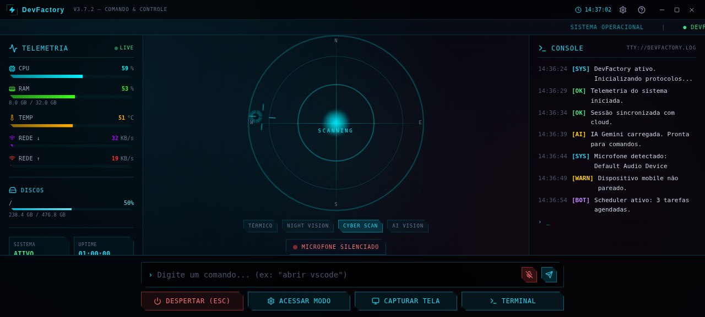
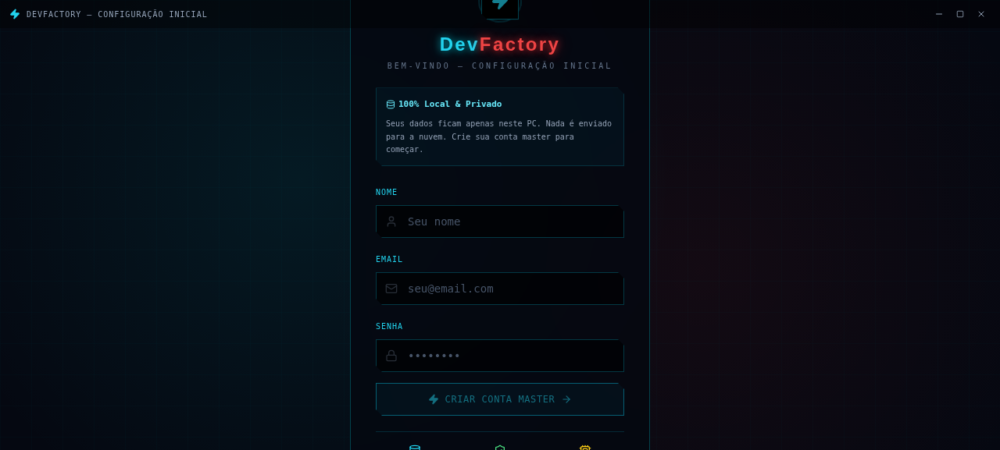
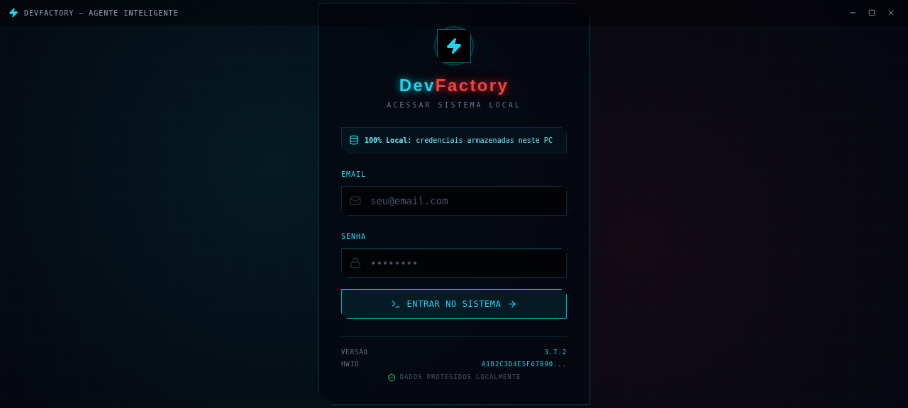
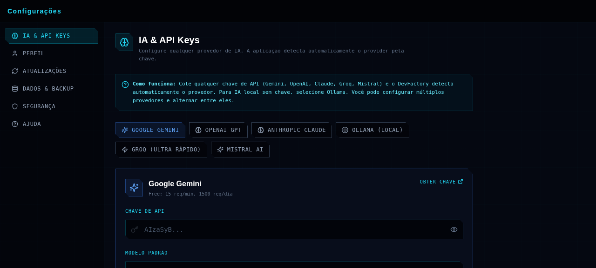
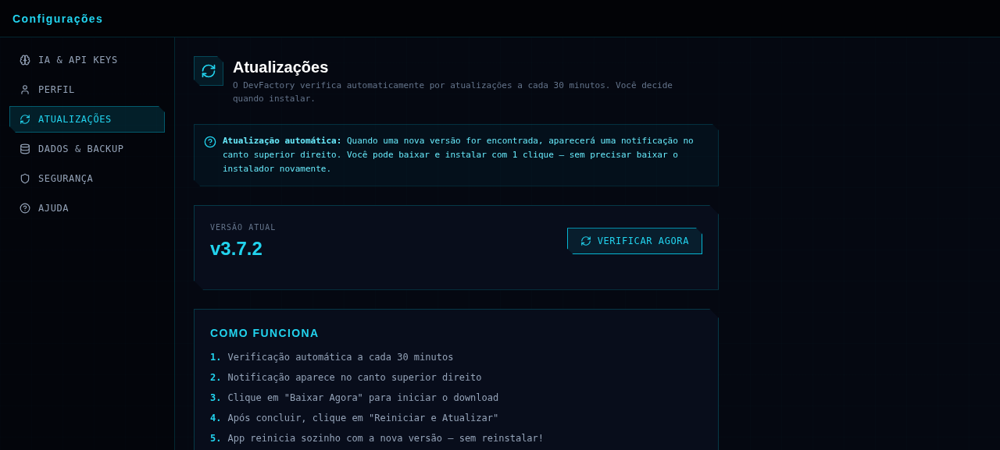
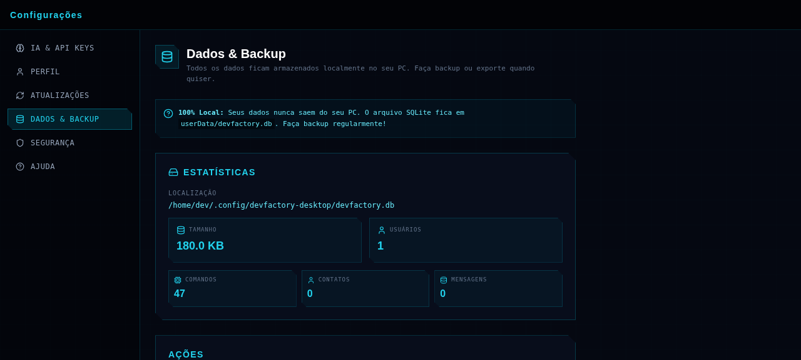
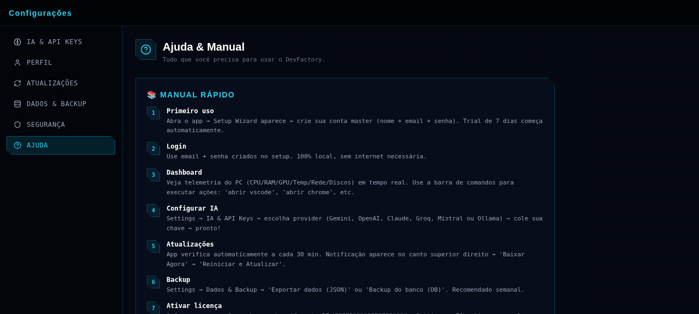

# DevFactory Desktop — Agente Inteligente para PC

> App desktop cyberpunk (Windows + macOS + Linux) que funciona como agente inteligente local. Executa tarefas no PC, recebe comandos remotos do celular e exibe telemetria em tempo real via HUD sci-fi. **100% local e privado** — seus dados nunca saem do seu PC.



## 📑 Índice

- [Instalação](#-instalação)
- [Primeiros Passos](#-primeiros-passos)
- [Manual por Seção](#-manual-por-seção)
  - [Setup Wizard (primeiro uso)](#1-setup-wizard-primeiro-uso)
  - [Login](#2-login)
  - [Dashboard](#3-dashboard)
  - [Settings → IA & API Keys](#4-settings--ia--api-keys)
  - [Settings → Atualizações](#5-settings--atualizações)
  - [Settings → Dados & Backup](#6-settings--dados--backup)
  - [Settings → Segurança](#7-settings--segurança)
  - [Settings → Ajuda](#8-settings--ajuda)
- [Auto-Update](#-auto-update)
- [API Keys (qualquer provider)](#-api-keys-qualquer-provider)
- [Arquitetura](#-arquitetura)
- [Build & Distribuição](#-build--distribuição)
- [Troubleshooting](#-troubleshooting)

---

## 🚀 Instalação

### Windows (.exe)
1. Baixe `DevFactory-Setup-3.7.2.exe` da [página de releases](https://github.com/clodoaldosilva608/DevFactory-Agente-Inteligente/releases)
2. Execute o instalador
3. Siga o wizard (escolha pasta, atalhos desktop/start menu)
4. Abra o DevFactory pelo atalho

### macOS (.dmg)
1. Baixe `DevFactory-3.7.2.dmg`
2. Abra o `.dmg` e arraste DevFactory para Applications
3. Na primeira execução: clique direito → "Abrir" (contorna Gatekeeper)

### Linux (.AppImage)
1. Baixe `DevFactory-3.7.2.AppImage`
2. Dê permissão: `chmod +x DevFactory-*.AppImage`
3. Execute: `./DevFactory-*.AppImage`

### Desenvolvimento (from source)
```bash
git clone https://github.com/clodoaldosilva608/DevFactory-Agente-Inteligente.git
cd DevFactory-Agente-Inteligente/desktop
bun install
DATABASE_URL="file:$(pwd)/devfactory.db" bun run db:push
bun run dev
```

---

## 🎯 Primeiros Passos

Após instalar, o DevFactory abre direto no **Setup Wizard** (primeiro uso). Siga:

1. **Crie sua conta master** (nome + email + senha)
2. **Trial de 7 dias começa automaticamente** (PRO plan)
3. **Configure a IA** (Settings → IA & API Keys)
4. **Comece a usar** o dashboard

---

## 📖 Manual por Seção

### 1. Setup Wizard (primeiro uso)



**O que faz**: Cria sua conta master local e inicializa o banco de dados.

**Como usar**:
1. Preencha **Nome** (mínimo 2 caracteres)
2. Preencha **Email** (válido, será seu login)
3. Crie **Senha** com:
   - Mínimo 8 caracteres
   - 1 letra maiúscula
   - 1 letra minúscula
   - 1 número
4. Clique em **"Criar Conta Master"**
5. App abre direto no dashboard

**Badges inferiores**:
- 🗄️ **Local DB** — dados ficam no seu PC
- 🛡️ **Privado** — nada vai para nuvem
- 💻 **Offline** — funciona sem internet

> ⚠️ **Importante**: Anote sua senha! Por ser 100% local, NÃO há recuperação de senha por email. Se esquecer, só com Factory Reset (perde todos os dados).

---

### 2. Login



**O que faz**: Autentica você no app (após setup já ter sido feito).

**Como usar**:
1. Digite email e senha criados no Setup
2. Clique em **"Entrar no Sistema"** (ou pressione Enter)
3. Sessão fica ativa por 30 dias (depois precisa logar de novo)

**Atalhos**:
- `Enter` — submit
- `ESC` — fechar app

**Info no rodapé**:
- Versão do app
- HWID (hardware fingerprint do seu PC, para licença)
- Status de segurança SSL

---

### 3. Dashboard


**O que faz**: Painel principal com telemetria do PC em tempo real + comandos.

**Layout (3 painéis)**:

#### Painel Esquerdo — Telemetria
Mostra métricas do seu PC atualizadas a cada 2 segundos:
- **CPU** — uso total + por core
- **RAM** — uso de memória ativa
- **TEMP** — temperatura do CPU
- **REDE ↓** — download (KB/s)
- **REDE ↑** — upload (KB/s)
- **Discos** — uso por partição

#### Painel Central — Radar Holográfico
- Radar animado estilo sci-fi
- 4 modos de visão (TÉRMICO, NIGHT VISION, CYBER SCAN, AI VISION)
- Status do microfone (ativo/silenciado)

#### Painel Direito — Console de Logs
- Logs em tempo real estilo terminal
- Categorias coloridas: `[SYS]`, `[OK]`, `[WARN]`, `[BOT]`, `[AI]`
- Auto-scroll para último log

#### Barra Inferior — Comandos
- **Input de comando**: digite e pressione Enter
  - Ex: `abrir vscode` → abre VS Code
  - Ex: `abrir chrome` → abre Chrome
- **Botão Microfone** (verde/vermelho): liga/desliga voz
- **4 Botões rápidos**:
  - 🔴 **Despertar (ESC)** — bip do sistema
  - 🔵 **Acessar Modo** — abre configurações
  - 🔵 **Capturar Tela** — screenshot
  - 🔵 **Terminal** — abre VS Code

**Header superior**:
- Logo DevFactory + versão
- Relógio em tempo real
- ⚙️ Botão Settings (engrenagem)
- ❓ Botão Ajuda
- Botões minimize/maximize/close (custom title bar)

**Status ticker** (logo abaixo do header):
- Mensagens animadas: `SISTEMA OPERACIONAL`, `DEVFACTORY ONLINE`, `MICROFONE SILANCIADO`, `CPU: X%`, etc.

---

### 4. Settings → IA & API Keys



**O que faz**: Configura provedores de IA. **Suporta qualquer provider** com detecção automática.

**Como usar**:

1. **Escolha o provider** (tabs no topo):
   - Google Gemini (free tier generoso)
   - OpenAI GPT (pago, melhor qualidade)
   - Anthropic Claude (pago, melhor para código)
   - Ollama Local (100% gratuito e offline)
   - Groq (free tier, ultra rápido)
   - Mistral AI (free tier)

2. **Cole sua API key** no campo "Chave de API"
   - App **detecta automaticamente** o provider pela chave
   - Validação acontece ao tirar o foco do campo
   - Status aparece: `Validando...` → `Chave válida!` ou `Formato inválido`

3. **Escolha o modelo padrão** (dropdown)
   - Cada provider tem seus modelos disponíveis
   - Ex Gemini: `gemini-2.0-flash`, `gemini-1.5-pro`, etc

4. **Clique em "Obter chave"** (canto superior direito) para abrir o site do provider e gerar uma chave

5. **Salve** com o botão "Salvar Configurações" no rodapé

**Para Ollama (local)**:
- Não precisa de chave
- Instale em [ollama.com](https://ollama.com)
- Rode `ollama pull llama3.1` no terminal
- Selecione o modelo no dropdown

**Detecção automática de provider**:
| Prefixo da chave | Provider detectado |
|-------------------|-------------------|
| `AIza...` | Google Gemini |
| `sk-proj-...`, `sk-...` | OpenAI GPT |
| `sk-ant-...` | Anthropic Claude |
| `gsk_...` | Groq |
| 30+ chars alfanuméricos | Mistral AI |
| (sem chave) | Ollama |

---

### 5. Settings → Atualizações



**O que faz**: Gerencia atualizações do app.

**Como usar**:
- **Versão atual** aparece no topo
- Clique em **"Verificar Agora"** para checar manualmente
- Verificação automática acontece a cada 30 minutos

**Fluxo de atualização**:
1. App detecta nova versão → notificação aparece no canto superior direito do dashboard
2. Card mostra: versão nova + data + release notes
3. Clique em **"Baixar Agora"** → barra de progresso aparece
4. Após download: **"Reiniciar e Atualizar"** → app reinicia sozinho
5. Pronto! Nova versão instalada (sem reinstalar)

**Botão "Depois"** adia por 30 minutos (depois notifica de novo).

---

### 6. Settings → Dados & Backup



**O que faz**: Gerencia o banco de dados local (SQLite).

**Estatísticas exibidas**:
- Localização do arquivo `.db` (ex: `~/.config/devfactory-desktop/devfactory.db`)
- Tamanho do banco
- Contagem por tabela (usuários, comandos, contatos, mensagens)

**Ações disponíveis**:
- **Exportar dados (JSON)** — backup completo em formato JSON legível
- **Backup do banco (DB)** — cópia binária do SQLite
- **Abrir pasta do banco** — mostra o arquivo no Explorer/Finder

**Zona Perigosa**:
- ⚠️ **Factory Reset** — apaga TODOS os dados (usuário, comandos, configs)
- Confirmação dupla: digite `APAGAR` para confirmar
- App reinicia em modo Setup Wizard

> 💡 **Recomendação**: Faça backup JSON semanalmente.

---

### 7. Settings → Segurança

**O que faz**: Altera sua senha local.

**Como usar**:
1. Digite senha atual
2. Digite nova senha (mínimo 8 caracteres)
3. Confirme nova senha
4. Clique em **"Alterar Senha"**

> ⚠️ Não há recuperação de senha por email (100% local). Se esquecer, só Factory Reset.

---

### 8. Settings → Ajuda



**O que faz**: Manual rápido + links de suporte.

**Conteúdo**:
- 7 passos do manual rápido (primeiro uso, login, dashboard, IA, updates, backup, licença)
- Link para GitHub Issues (reportar bugs)
- Email de suporte: contato@devfactory.app

---

## 🔄 Auto-Update

O DevFactory verifica atualizações automaticamente:

| Quando | O que acontece |
|--------|---------------|
| App abre | Verifica 5s após iniciar |
| A cada 30 min | Re-verifica em background |
| Nova versão | Notificação aparece no canto superior direito |
| User clica "Baixar" | Download em background com barra de progresso |
| Download concluído | Botão "Reiniciar e Atualizar" aparece |
| User clica "Reiniciar" | App fecha, instala, reabre com nova versão |

**Sem reinstalação!** O Electron baixa apenas o diff e aplica automaticamente.

**URL de update**: GitHub Releases do repo `clodoaldosilva608/DevFactory-Agente-Inteligente`.

Para publicar uma nova versão:
1. Bump versão em `desktop/package.json`
2. Commit + push
3. Criar tag: `git tag v3.8.0 && git push origin v3.8.0`
4. GitHub Actions gera .exe/.dmg/.AppImage e publica no Releases
5. Apps instalados detectam automaticamente em até 30 min

---

## 🔑 API Keys (qualquer provider)

O DevFactory suporta **6 provedores de IA** com detecção automática:

| Provider | Free tier | Como obter chave |
|----------|-----------|------------------|
| **Google Gemini** | 15 req/min, 1500 req/dia | [aistudio.google.com/apikey](https://aistudio.google.com/apikey) |
| **OpenAI GPT** | Não (pago) | [platform.openai.com/api-keys](https://platform.openai.com/api-keys) |
| **Anthropic Claude** | $5 crédito inicial | [console.anthropic.com/settings/keys](https://console.anthropic.com/settings/keys) |
| **Groq** | 30 req/min, 14400 req/dia | [console.groq.com/keys](https://console.groq.com/keys) |
| **Mistral AI** | ~$8 crédito/mês | [console.mistral.ai/api-keys](https://console.mistral.ai/api-keys) |
| **Ollama (local)** | 100% gratuito | Instale em [ollama.com](https://ollama.com) — sem chave |

### Detecção automática

Cole qualquer chave no campo e o DevFactory detecta qual é o provider:

- `AIza...` → Gemini
- `sk-proj-...` ou `sk-...` → OpenAI
- `sk-ant-...` → Anthropic
- `gsk_...` → Groq
- 30+ chars alfanuméricos → Mistral

Você pode configurar **múltiplos providers** e alternar entre eles a qualquer momento.

---

## 🏗️ Arquitetura

```
desktop/
├── src/
│   ├── main/                    # Electron Main Process (Node.js)
│   │   ├── index.ts             # Entry: BrowserWindow + tray + auto-update
│   │   ├── db/                  # SQLite local (Prisma)
│   │   │   └── index.ts         # initDb, getDb, closeDb, stats, export, wipe
│   │   └── ipc/                 # IPC handlers (bridge renderer ↔ main)
│   │       ├── system.ts        # System info, open URLs/paths
│   │       ├── files.ts         # File ops (sandboxed to home + tmp)
│   │       ├── exec.ts          # Allowlisted app launcher + shell exec
│   │       ├── auth.ts          # Local bcrypt + sessions + license
│   │       ├── telemetry.ts     # Real-time CPU/RAM/GPU/Temp polling
│   │       └── database.ts      # DB stats, export, backup, wipe
│   ├── preload/
│   │   └── index.ts             # Secure contextBridge (typed API)
│   └── renderer/                # React UI (Vite)
│       └── src/
│           ├── pages/
│           │   ├── SetupPage.tsx       # First-run wizard
│           │   ├── LoginPage.tsx       # Local auth
│           │   ├── DashboardPage.tsx   # HUD cyberpunk
│           │   └── SettingsPage.tsx    # 6 tabs (AI, Profile, Updates, Data, Security, Help)
│           ├── components/
│           │   ├── BootScreen.tsx      # Animated boot sequence
│           │   └── UpdateNotifier.tsx  # Auto-update notification card
│           ├── mock-electron.ts        # Browser dev mock (for testing)
│           └── types/global.d.ts       # window.devfactory type
├── prisma/
│   └── schema.prisma            # 11 tabelas (User, Settings, Session, License, etc)
├── build/                       # Icons + entitlements + installer.nsh
├── electron-builder.yml         # NSIS + DMG + AppImage config
├── package.json
└── README.md (este arquivo)
```

### Banco de Dados Local

- **Tipo**: SQLite (file-based, sem servidor)
- **Localização**: `userData/devfactory.db`
  - Windows: `%APPDATA%/devfactory-desktop/devfactory.db`
  - macOS: `~/Library/Application Support/devfactory-desktop/devfactory.db`
  - Linux: `~/.config/devfactory-desktop/devfactory.db`
- **Tamanho inicial**: ~180KB
- **Tabelas**: User, UserSettings, Session, License, CommandLog, Automation, Contact, Message, PairedDevice, AIConversation, AIMessage

### Segurança

- **contextIsolation: true** — renderer não tem acesso direto ao Node
- **nodeIntegration: false** — sem `require` no renderer
- **CSP strict** — apenas self + localhost para dev
- **File operations sandboxed** — limitado a `os.homedir()` e `os.tmpdir()`
- **App launcher allowlisted** — apenas apps pré-aprovados (vscode, chrome, etc)
- **Shell exec** — restrito, timeout 30s, buffer 5MB
- **Senhas com bcrypt** (12 rounds)
- **Sessões com token** (32 bytes random, expiry 30 dias)

---

## 📦 Build & Distribuição

### Build local (testar antes de distribuir)
```bash
cd desktop
bun install
bun run build    # compila TS + Vite
bun run preview  # roda Electron com build de produção
```

### Gerar instaladores
```bash
# Windows (.exe NSIS installer + portable)
bun run dist:win

# macOS (.dmg + .zip)
bun run dist:mac

# Linux (.AppImage + .deb + .tar.gz)
bun run dist:linux

# Todos (plataforma atual)
bun run dist
```

Os instaladores são gerados em `desktop/release/`.

### Auto-update (publicar nova versão)

1. **Bump versão** em `desktop/package.json`:
   ```json
   "version": "3.8.0"
   ```

2. **Commit + tag + push**:
   ```bash
   git add desktop/package.json
   git commit -m "release: v3.8.0"
   git tag v3.8.0
   git push origin main --tags
   ```

3. **GitHub Actions** (configurar `.github/workflows/release.yml`) detecta a tag, roda `bun run dist` em Windows/macOS/Linux e publica os instaladores no GitHub Releases.

4. **Apps instalados detectam automaticamente** em até 30 minutos e mostram a notificação de update.

---

## 🛠️ Troubleshooting

### App não abre no Windows
- **"SmartScreen impediu a inicialização"** → clique "Mais informações" → "Executar mesmo assim" (app não é code-signed ainda)
- **"VCRUNTIME140.dll não encontrado"** → instale [Visual C++ Redistributable 2015-2022](https://aka.ms/vs/17/release/vc_redist.x64.exe)

### Esqueci minha senha
- Por ser 100% local, NÃO há recuperação por email
- Faça **Factory Reset**:
  1. Abra Settings → Dados & Backup
  2. Clique em "Factory Reset"
  3. Digite `APAGAR` para confirmar
  4. App reinicia em modo Setup Wizard
- ⚠️ Você perde todos os dados locais

### Notificação de update não aparece
- Verifique sua conexão com internet
- Settings → Atualizações → "Verificar Agora"
- Pode ter sido dispensada (volta em 30 min)

### IA não responde
- Verifique se a chave API está válida (Settings → IA & API Keys)
- Para Ollama: verifique se o serviço está rodando (`ollama list`)
- Veja logs no console do dashboard

### Banco de dados corrompido
- Settings → Dados & Backup → "Backup do banco (DB)" (tente recuperar)
- Se não funcionar: Factory Reset e restaure de um backup JSON anterior

### App lento
- Verifique uso de CPU/RAM no dashboard
- Desative telemetry se necessário (Settings → ... em breve)
- Feche outros apps pesados

### Como reportar bugs
- [GitHub Issues](https://github.com/clodoaldosilva608/DevFactory-Agente-Inteligente/issues)
- Email: contato@devfactory.app
- Inclua: versão do app, sistema operacional, prints do erro

---

## 📝 Licença

Proprietário. Todos os direitos reservados à **DevFactory**.

## 👨‍💻 Autor

**DevFactory** (clodoaldosilva608)
- GitHub: [@clodoaldosilva608](https://github.com/clodoaldosilva608)

---

<p align="center">
  <strong>DevFactory</strong> — Seu PC obedece. Seu celular comanda.<br>
  100% Local & Privado.
</p>
